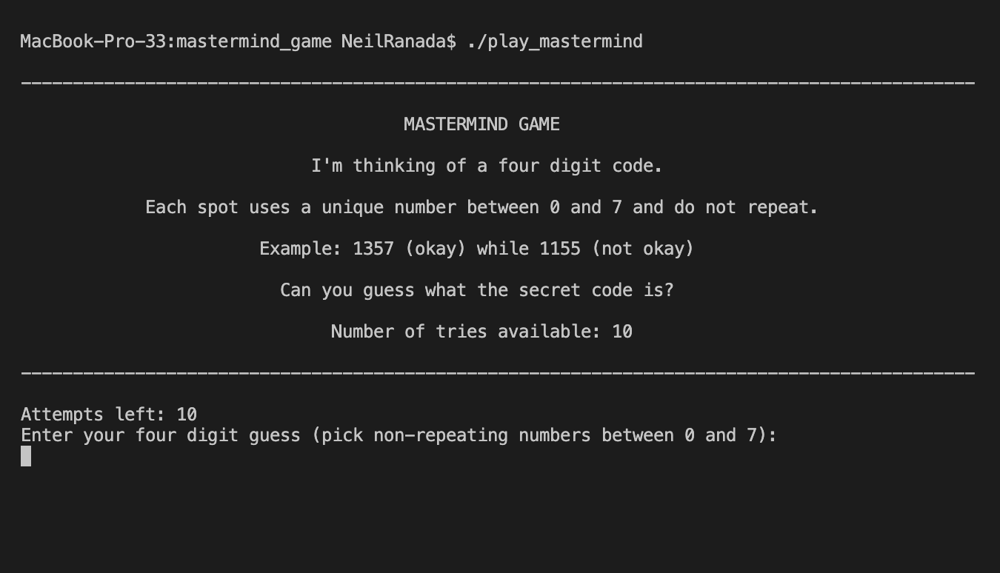

# Mastermind Game

mastermind.c

Original author: Neil Ranada

This is a command line game where you have to guess a **four digit secret code** using **non-repeating numbers between 0 and 7 (Example: 0357).**

You can play by yourself against a **random auto-magically generated secret code.**

**Or, set a custom four digit code** using non-repeating numbers between 0 and 7 and **set the number of attempts** available to a player (default is 10 attempts).

## How to install

- You can download the project folder and files manually to your computer or fork the Github repo at:
https://github.com/Ranada/mastermind_game
- Or through your terminal, clone this repository: `git clone https://github.com/Ranada/mastermind_game`
- Go to the directory containing this project: `cd mastermind_game`
- Check to see you have a GCC compiler installed: `gcc --version` (if not installed, consider using Homebrew method: https://formulae.brew.sh/formula/gcc)
- Compile automatically using the makefile using `make` or manually `gcc -Wall -Wextra -Werror *.c -o play_mastermind`

## How to play

### To play against a randomly generated secret code

- In the command line type `./play_mastermind`
- Enter your four digit guess (using numbers between 0 and 7) in the command line until you run out of attempts

### To play with custom settings

- To set only the custom four digit code, add a "-c" flag add a four digit number (using non-repeatind numbers between 0 and 7): `./play_mastermind -c 1234`
- To set only the number of attempts add a "-t" flag and add the desired number of attempts: `./my_mastermind -t 20`
- To set both the secret code and number of attempts a "-c" and "-t" flag and update the numbers in the example: `./play_mastermind -c 1234 -t 10`
- The player enters a four digit guess (using numbers between 0 and 7) in the command line until they run out of attempts
